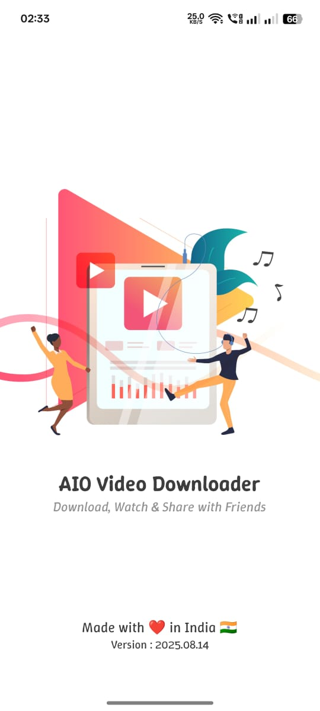
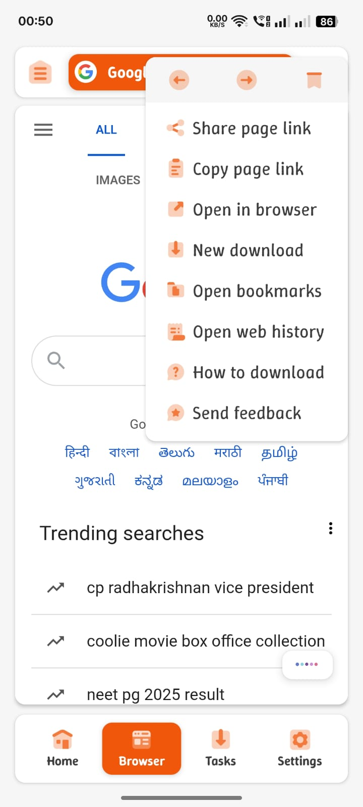
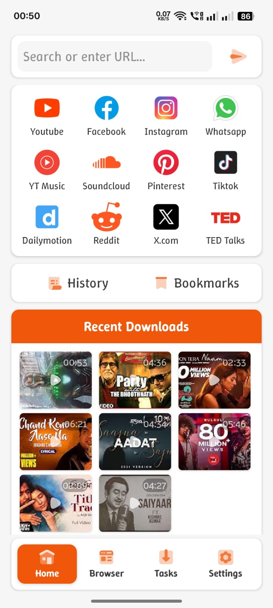
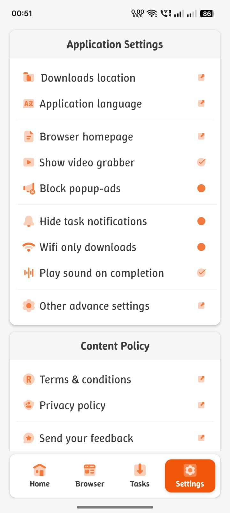
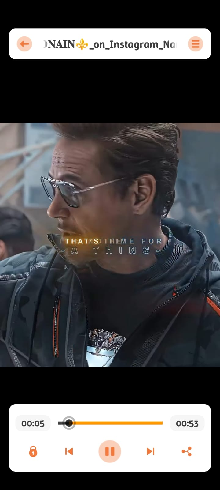
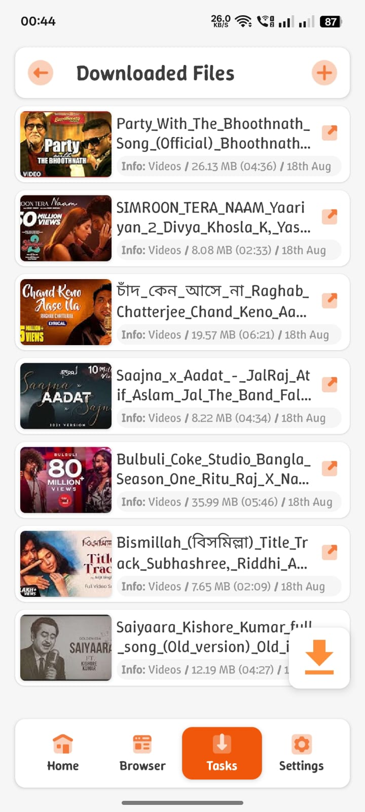

# AIO Video Downloader

### 📥 Powerful Video/Audio Downloader for Android — Open Source, Ad-Free, and Built on yt-dlp for a Seamless, User-Centric Experience

## 📌 Introduction

AIO Video Downloader is an open-source Android application built on on the robust
**[yt-dlp](https://github.com/yt-dlp/yt-dlp)** backend with the help
of [youtubedl-android](https://github.com/yausername/youtubedl-android),
aiming to become the most powerful download manager available. Unlike VidMate or SnapTube, AIO
avoids unnecessary complexity and ad-heavy bloat, offering a clean and efficient interface while
unlocking advanced downloading capabilities with minimal setup.

With support for 1000+ sites and virtually any downloadable content across the web, AIO is designed
to deliver a seamless yet powerful experience that balances speed, flexibility, and simplicity.

## 📱 Screenshots

## ✨ Key Features

- **1000+ Website Support**: Thanks to yt-dlp backend, download from virtually any video platform
- **Clean & Intuitive UI**: Simple interface focused on what matters - finding and downloading
  content
- **No Ads**: Completely ad-free experience
- **Multiple Resolutions**: Download videos in various qualities (up to 4K where available)
- **Audio Extraction**: Save videos as MP3 audio files
- **Batch Downloads**: Queue multiple downloads at once
- **Background Downloads**: Continue using your device while downloads complete
- **Download Manager**: Pause, resume, or cancel downloads
- **Built-in Browser**: Securely browse supported sites within the app
- **Open Source**: Transparent codebase you can audit and contribute to
- **Made in India**: Developed with pride by Indian developers

---

**Made with ❤️ in India** 🇮🇳

*AIO Video Downloader is not affiliated with VidMate, SnapTube, or any other proprietary video
downloader.*